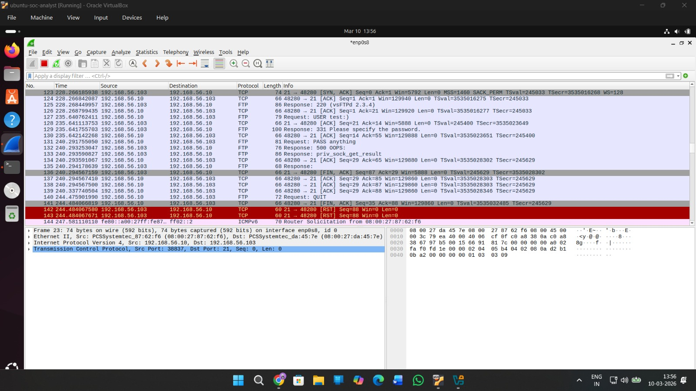
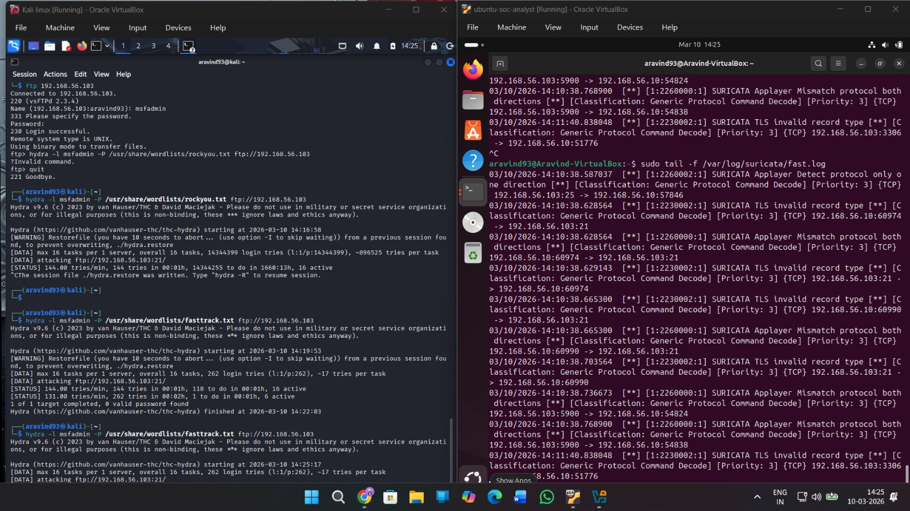
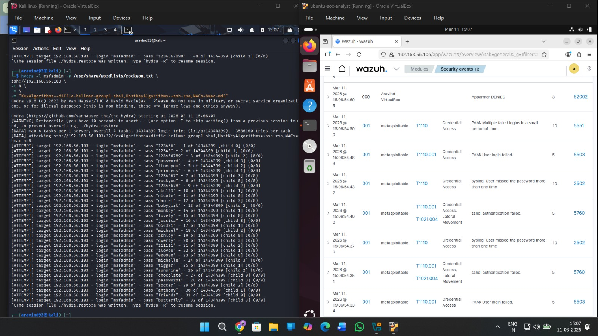
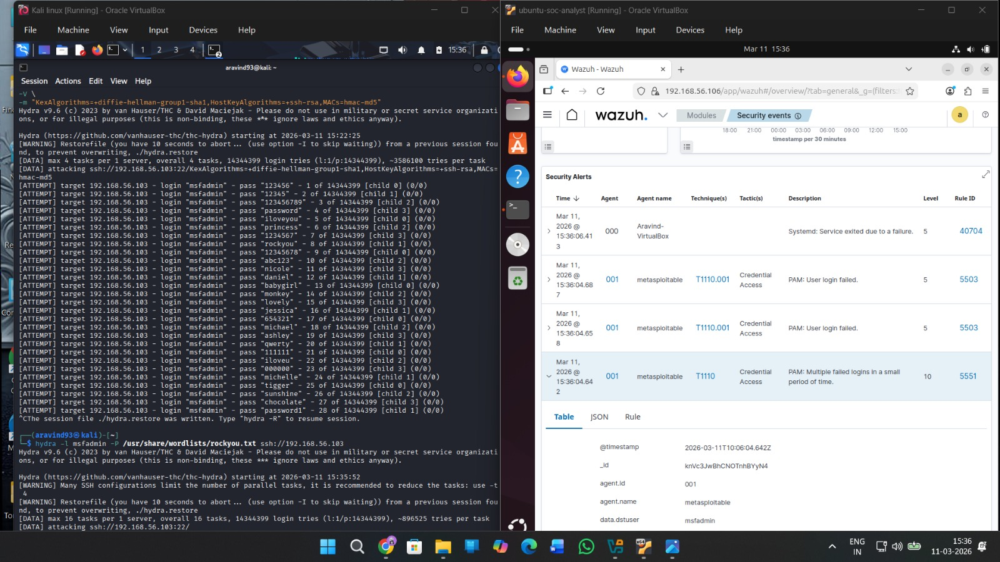

# 🛡️ SOC Home Lab — Threat Detection & Threat Hunting

A fully virtualized Security Operations Center (SOC) lab built for hands-on practice in threat detection, intrusion analysis, brute-force simulation, and SIEM operations. This lab replicates a real-world SOC environment using open-source tools across multiple operating systems.

---

## 📸 Lab Screenshots

| Wireshark — FTP TCP Packets | Suricata — Brute Force Logs |
|---|---|
|  |  |

| Wazuh — Brute Force Attack Detection | Wazuh — Attack Event Logs |
|---|---|
|  |  |

---

## 🖥️ Lab Architecture

| Role | OS | IP Address |
|---|---|---|
| Attacker Node | Kali Linux | `192.168.56.10` |
| Vulnerable Target | Metasploitable 2 | `192.168.56.103` |
| Corporate Workstation | Windows 10 | Host-only network |
| SOC Monitor / SIEM | Ubuntu Server | `192.168.56.106` |

All VMs run in **Oracle VirtualBox** on an isolated `enp0s8` host-only network adapter.

---

## 🧰 Tools & Technologies

### Offensive (Attacker — Kali Linux)
- **Nmap** — Network reconnaissance and port scanning
- **Metasploit Framework** — Exploitation (vsftpd 2.3.4 backdoor)
- **Hydra** — FTP and SSH brute-force attacks
- **Burp Suite** — Web application interception and injection
- **Wireshark** — Packet capture and traffic analysis

### Defensive (SOC Monitor — Ubuntu)
- **Splunk Enterprise** — Central SIEM and log aggregation (port `8000`)
- **Wazuh** — Host-based Intrusion Detection System (HIDS) / EDR
- **Suricata** — Network Intrusion Detection System (NIDS)
- **Sysmon** *(Windows)* — Deep endpoint telemetry

### Utilities
- **htop** — Lightweight terminal process monitor
- **vtop** — Visual terminal dashboard (Node.js)

---

## 📅 14-Day Operational Roadmap

### Days 1–2 — Infrastructure & SIEM Initialization
- Install **Splunk Enterprise** on Ubuntu; expose web UI at `http://localhost:8000`
- Install **Sysmon** on Windows endpoint:
  ```
  sysmon64.exe -accepteula -i sysmonconfig.xml
  ```
- Configure Splunk Universal Forwarder to ingest Windows Security logs
- Fix XML parsing with SPL regex extraction:
  ```
  | rex field=_raw "<EventID>(?<EventID>\d+)</EventID>"
  ```
- Enable `WinEventLog:Security` input in `inputs.conf` for Event IDs 4624/4625

### Days 3–4 — Network Reconnaissance & Packet Analysis
- Run Nmap SYN scan against Metasploitable:
  ```
  nmap -sS -sV -O 192.168.56.103
  ```
- Capture traffic in **Wireshark** on `enp0s8` to baseline normal vs. scan traffic
- Discover **vsftpd 2.3.4** on TCP port 21 (CVE-2011-2523)

### Days 5–6 — Exploitation & Packet-Level Troubleshooting
- Exploit vsftpd 2.3.4 backdoor via Metasploit:
  ```
  use exploit/unix/ftp/vsftpd_234_backdoor
  set RHOST 192.168.56.103
  run
  ```
- Diagnose `500 OOPS: priv_sock_get_result` error using Wireshark TCP stream analysis
- Fix: disable AppArmor profile or adjust vsftpd privilege separation on target

### Days 7–8 — Network IDS with Suricata
- Deploy **Suricata** on Ubuntu, bind to `enp0s8`
- Execute FTP brute-force from Kali using **Hydra**:
  ```
  hydra -l msfadmin -P /usr/share/wordlists/rockyou.txt ftp://192.168.56.103
  ```
- Monitor live alerts:
  ```
  tail -f /var/log/suricata/fast.log
  ```
- Tune Emerging Threats (ET) rules for FTP brute-force detection (SID `2002383`)

### Days 9–10 — Host-Based IDS with Wazuh
- Deploy **Wazuh agents** on Metasploitable and Windows endpoints
- Simulate SSH brute-force from Kali:
  ```
  hydra -l msfadmin -P /usr/share/wordlists/rockyou.txt ssh://192.168.56.103
  ```
- Analyze Wazuh dashboard alerts: Rule 5551, 5710, 5712 (brute-force correlation)
- Map alerts to **MITRE ATT&CK**: T1110.001, T1021.004

### Days 11–12 — Web Application Security & Splunk SPL Hunting
- Intercept HTTP traffic with **Burp Suite** targeting DVWA / Mutillidae on Metasploitable
- Inject SQL and XSS payloads; detect in Splunk:
  ```spl
  sourcetype=access_combined
  | regex uri="(?i)(UNION|SELECT|INSERT|DROP|OR 1=1|--)"
  | stats count by clientip, uri, status
  | sort - count
  ```

### Days 13–14 — System Resource Monitoring & Incident Response
- Use **htop** for lightweight process analysis (sort by CPU: `P`, kill: `F9`)
- Install and use **vtop** for visual dashboards:
  ```
  sudo apt install nodejs npm
  sudo npm install -g vtop
  ```
- Practice identifying rogue processes during active attacks

---

## 🔍 Key Detection Use Cases

| Attack | Tool Detected By | Rule / Alert |
|---|---|---|
| Nmap SYN Scan | Wireshark / Suricata | TCP half-open handshake pattern |
| vsftpd 2.3.4 Backdoor | Wireshark | `USER :)` + `500 OOPS` TCP stream |
| FTP Brute Force | Suricata | ET SID 2002383 — `530` responses |
| SSH Brute Force | Wazuh | Rule 5551, 5712 — T1110 |
| SQL Injection | Splunk SPL | Regex on `uri` field |
| XSS Injection | Splunk SPL | `<script>` / `%3Cscript%3E` in URI |
| Credential Access | Wazuh | Rule 5503 — PAM login failures |
| Lateral Movement | Wazuh | Rule 5760 — T1021.004 |

---

## ⚙️ Prerequisites

- [Oracle VirtualBox](https://www.virtualbox.org/) (host-only network adapter configured)
- Kali Linux ISO
- Metasploitable 2 VM image
- Windows 10 ISO
- Ubuntu Server 22.04 LTS ISO
- Minimum **16 GB RAM** recommended (8 GB usable)

---

## 📂 Repository Structure

```
soc-lab/
├── configs/
│   ├── sysmonconfig.xml          # Sysmon telemetry configuration
│   ├── suricata/
│   │   └── local.rules           # Custom Suricata detection rules
│   └── splunk/
│       └── inputs.conf           # Splunk Universal Forwarder config
├── screenshots/
│   ├── wiresharklogs.jpeg
│   ├── wiresharktcp21packets.jpeg
│   ├── suricatabruteforcelogs.jpeg
│   ├── wazuhbruteforceattack.jpeg
│   └── wazuhattacklogs.jpeg
├── splunk-queries/
│   └── threat_hunting.spl        # SPL queries for web attack hunting
└── README.md
```

---

## 🧠 MITRE ATT&CK Coverage

| Technique | ID | Tool |
|---|---|---|
| Brute Force: Password Guessing | T1110.001 | Hydra → Wazuh |
| Remote Services: SSH | T1021.004 | Hydra → Wazuh |
| Exploit Public-Facing Application | T1190 | Metasploit → Wireshark |
| Network Service Scanning | T1046 | Nmap → Suricata |
| Valid Accounts | T1078 | FTP login → Wazuh |

---

## ⚠️ Disclaimer

This lab is intended **strictly for educational purposes** in an isolated, controlled virtual environment. All attacks are performed against intentionally vulnerable machines. Do not use these techniques against systems you do not own or have explicit permission to test.

---

## 📖 References

- [Metasploitable 2 Documentation](https://docs.rapid7.com/metasploit/metasploitable-2/)
- [Suricata Rules Documentation](https://suricata.readthedocs.io/en/suricata-6.0.0/rules/)
- [Wazuh Rule Reference](https://documentation.wazuh.com/current/user-manual/ruleset/ruleset-xml-syntax/)
- [MITRE ATT&CK Framework](https://attack.mitre.org/)
- [Splunk SPL Reference](https://docs.splunk.com/Documentation/Splunk/latest/SearchReference/)
- [Sysmon Configuration Guide](https://github.com/SwiftOnSecurity/sysmon-config)

---

*Built as a hands-on SOC analyst training environment. Contributions and improvements welcome.*
